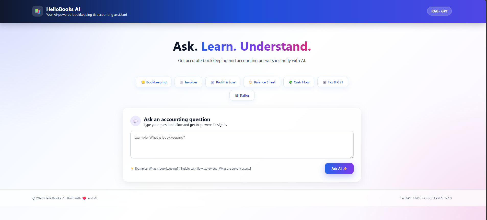
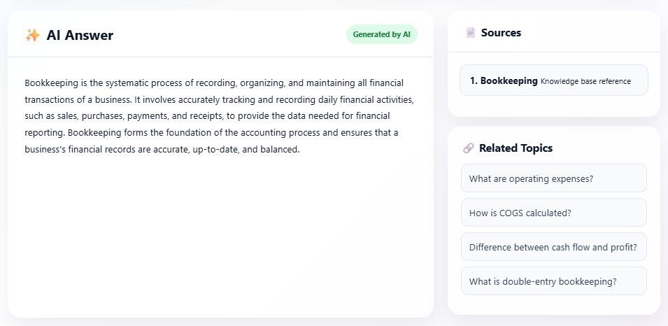
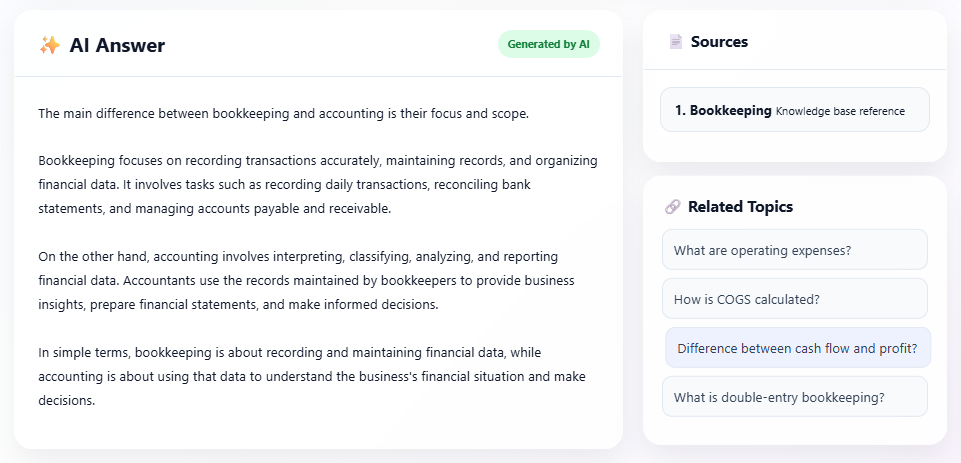
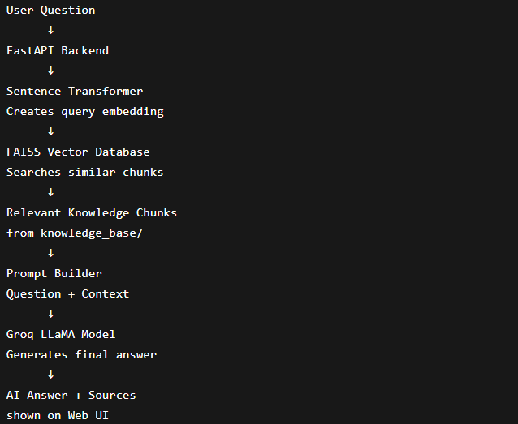

# 📚 HelloBooks AI

> An AI-powered bookkeeping assistant built using **FastAPI**, **FAISS**, **Sentence Transformers**, and **Groq LLaMA** with a **Retrieval-Augmented Generation (RAG)** architecture.

---

# 🖼️ Screenshots

## Home Page



## AI Response
 

 


## Architecture Diagram


---

# 📖 Overview

HelloBooks AI is an intelligent bookkeeping assistant that answers accounting and finance-related questions using Retrieval-Augmented Generation (RAG).

The system retrieves relevant information from a custom bookkeeping knowledge base using semantic vector search and generates contextual answers using Groq LLaMA.

This project demonstrates practical implementation of:

- Retrieval-Augmented Generation (RAG)
- Semantic Search
- Vector Databases
- Large Language Models
- FastAPI Backend Development
- AI System Architecture

---

# ❓ Problem Statement

Traditional keyword-based search systems fail to understand semantic meaning and often return irrelevant results.

HelloBooks AI solves this problem by:

- Understanding natural language queries
- Retrieving semantically relevant bookkeeping content
- Generating intelligent context-aware responses
- Providing source-based answers

This makes financial and bookkeeping concepts easier to understand for students, freelancers, and small businesses.

---

# ⚙️ RAG Pipeline Architecture

```text
User Question
      │
      ▼
Generate Query Embedding
(HuggingFace Sentence Transformer)
      │
      ▼
Search FAISS Vector Index
      │
      ▼
Retrieve Top-K Relevant Chunks
      │
      ▼
Build Prompt with Context
      │
      ▼
Groq LLaMA Generates Answer
      │
      ▼
Return Answer + Sources
```

---

# 🗂️ Project Structure

```text
HelloBooks-AI/
│
├── knowledge_base/
│   ├── bookkeeping.md
│   ├── invoices.md
│   ├── balance_sheet.md
│   ├── cash_flow.md
│   ├── taxation_gst.md
│   └── financial_ratios.md
│
├── src/
│   ├── rag.py
│   └── app.py
│
├── templates/
│   └── index.html
│
├── Screenshots/
│
├── Dockerfile
├── docker-compose.yml
├── requirements.txt
├── .env.example
├── README.md
└── .gitignore
```

---

# 🚀 Features

- AI-powered bookkeeping assistant
- Retrieval-Augmented Generation (RAG)
- Semantic document search
- FastAPI backend
- FAISS vector database
- Sentence Transformer embeddings
- Groq LLaMA integration
- Source-aware responses
- Docker support
- Lightweight local deployment

---

# 🛠️ Tech Stack

| Layer | Technology |
|-------|------------|
| Backend | FastAPI |
| Language | Python |
| Embeddings | Sentence Transformers |
| Vector Store | FAISS |
| LLM | Groq LLaMA 3.3 70B |
| Frontend | HTML, CSS, JavaScript |
| Deployment | Docker + Docker Compose |

---

# ✅ Prerequisites

| Tool | Notes |
|------|------|
| Python 3.11+ | Recommended |
| Groq API Key | Free from console.groq.com |
| Docker (Optional) | For container deployment |

---

# 🚀 Installation

## Step 1 — Clone Repository

```bash
git clone https://github.com/YASH-02042002/HelloBook-AI.git
cd HelloBook-AI
```

---

## Step 2 — Create Virtual Environment

### Windows

```bash
py -3.11 -m venv venv
venv\Scripts\activate
```

### Mac/Linux

```bash
python3 -m venv venv
source venv/bin/activate
```

---

## Step 3 — Install Dependencies

```bash
pip install -r requirements.txt
```

---

## Step 4 — Setup Environment Variables

Create `.env` file:

```env
GROQ_API_KEY=gsk_your_api_key_here
```

---

## Step 5 — Build Vector Index

```bash
python src/rag.py --build
```

---

## Step 6 — Start Application

```bash
python src/app.py
```

---

## Step 7 — Open in Browser

```text
http://localhost:8000
```

---

# 🐳 Docker Deployment

## Build Docker Image

```bash
docker build -t hellobooks-ai .
```

---

## Run Docker Container

```bash
docker run -p 8000:8000 --env-file .env hellobooks-ai
```

---

## Run with Docker Compose

```bash
docker-compose up --build
```

---

## Stop Docker Containers

```bash
docker-compose down
```

---

# 🌐 API Endpoints

## GET /

Returns the web interface.

---

## GET /health

```json
{
  "status": "ok",
  "index_loaded": true,
  "vectors": 36
}
```

---

## POST /ask

### Request

```json
{
  "question": "What is bookkeeping?"
}
```

### Response

```json
{
  "question": "What is bookkeeping?",
  "answer": "Bookkeeping is the process of recording financial transactions...",
  "sources": ["Bookkeeping"],
  "chunks": []
}
```

---

## POST /rebuild-index

Rebuilds FAISS vector index from the knowledge base.

---

# 💡 Example Questions

```text
What is bookkeeping?
```

```text
Explain double-entry bookkeeping with an example.
```

```text
What are common bookkeeping mistakes businesses should avoid?
```

```text
What is the role of bookkeeping in tax preparation?
```

---

# 📚 Knowledge Base Topics

| File | Topics |
|------|--------|
| bookkeeping.md | Journals, ledgers, double-entry |
| invoices.md | Invoice management |
| balance_sheet.md | Assets, liabilities, equity |
| cash_flow.md | Cash flow analysis |
| taxation_gst.md | GST and taxation |
| financial_ratios.md | Financial performance ratios |

---

# ⚠️ Challenges Faced

One major challenge was improving semantic retrieval quality.

Initially, keyword-based retrieval produced inaccurate results.  
To solve this issue, semantic embeddings using Sentence Transformers and FAISS similarity search were implemented.

Another challenge involved handling compatibility issues between Python versions and AI libraries such as FAISS and Sentence Transformers.

---

# 🔮 Future Improvements

- PDF and DOCX ingestion
- Multi-user authentication
- Chat history memory
- Cloud deployment
- Advanced reranking
- Citation highlighting
- Voice-based interaction

---

# 🎥 Demo Video

[Watch Demo Video](YOUR_VIDEO_LINK)

---

# 📄 License

MIT License — free to use and modify.

---

# 👨‍💻 Author

Yash Paliwal

GitHub:
https://github.com/YASH-02042002
